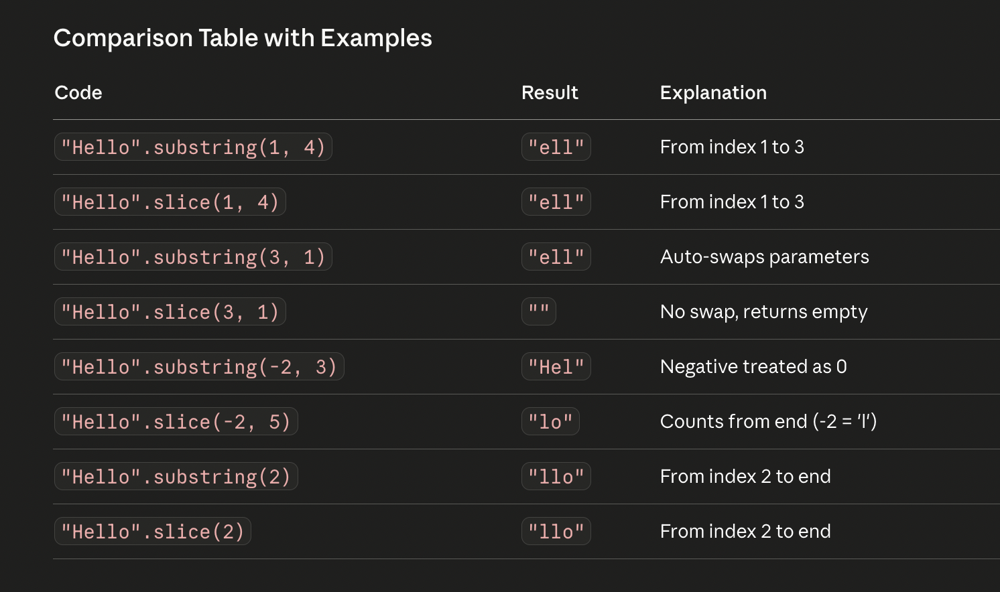

## Difference between var, let and const

- Sum of two integers
- Relationship between integer and string
- Sum and message
  - type coercion
  - Greet the user
- Accept and print the answer
- Swap two variables via three methods

