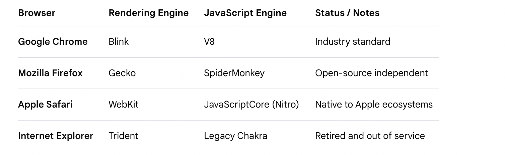

# JS divided into 6 Phases

## phase 1: Foundations ()

1990s - Tim Bernles-lee
HTML
http
Server

Netscape wants to build a browser to build dynamic pages
mosiac -

First website in the world - https://info.cern.ch/

Netscape - Brenden Eic (employee) ->
Mocha language (Netscape Navigator)
Live script:-
livescript named to javascript:-

microsft - internet Explorer :- Jscript

ECMA - European Computer Manufacturers Association -
ECMA script - standard
ES1 ES2 ES3 ES3.1 ES5
ES6 - ES2015
...

Netscape -- developed Mozilla
2008 - Chrome browser - V8 Engine

Ryan Dhal found Nodejs in 2009

# JavaScript

JavaScript is a single threaded Synchronous programming language which can be used for multiple purposes

- Frontend
- Server
- Backend
- can use multiple libraries (React, Angular, Express)
- can built mobile applications (for eg: React Native)
- can built Desktop applications
- Robots
- DAPPS ()

  

### Client Side

### Server Side

### JS is dynamically interpreted language

## DataTypes

- Primitive
  - Number (10, 20.55, -10, 99999)
  - String ('h', 'hello',"Sheryians Coding School")
  - Boolean (true, false)
  - undefined (variable is declared but not initialized and default value taken by JS is undefined)
  - null (primitive datatype, intentional absence of any object value)
  - BigInt (number's range is 2^53-1 , beyond that range is BigInt)
  - Symbol (Symbol is a unique and immutable primitive data type)
- Non-primitive (Reference )
  - Array
  - Objects
  - Function

  Primitive : at one point of time , only one value will be stored

## phase 2 : Functions, arrays, objects

## phase 3: the HOW Begins ()

## Phase 4:Objects Deeper & this

## phase 5: Asynchronous

## phase 6: Modern & Practical JS
