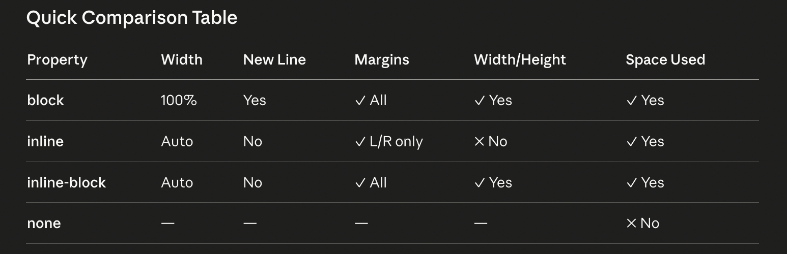

# CSS - Cascading Style Sheets

1. Basic Selectors

- Universal selector (\*)
- Element selctor
- Class selector
- ID selector
- Group selector

--

2. Colors and Units

- color
- background-color
- HEX
- RGB
- RGBA
- px
- %
- em
- rem

3. Text styling

- text-align
- text-transform
- text-decoration
- line-height
- letter-spacing
- word-spacing

4. Fonts

- font-family
- font-size
- font-weight
- font-style
- Google fonts

5. Box model

- width
- height
- border
- padding
- margin
- box-sizing

6. Background

- background-color
- background-image
- background-size
- background-repeat
- background-position

7. Display property

- block
- inline
- inline-block
- none

8. Flexbox

- display flex
- flex-direction
- justify-content
- align-items
- flex-wrap
- gap

9. Grid

- display grid
- grid-template-columns
- grid-template-rows
- gap
- place-items

10. Positioning

- static (default)
- relative
- absolute
- fixed
- sticky
- z-index

11. pseudo classes
    - helpful functions for css to change the state

- :hover
- :focus
- :nth-child()
- :first-child

12. Transitions

- transition
- duration
- ease-in-out
- delay

transition: property duration timing-function delay ;

13. Transform

- translate()
- rotate()
- scale()

14. Animations

- @keyframes
- animation-name
- duration
- iteration-count
- infinite

we use gsap.

# 3 ways of enabling css

1. Internal CSS
2. Inline CSS
3. External CSS
